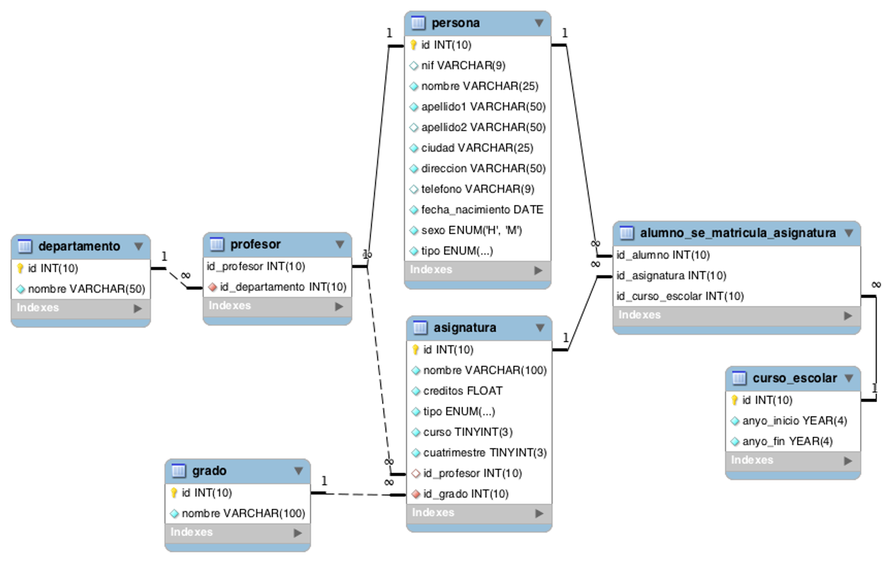

# Taller 1

### **1. Crear base de datos**

Con base en el diagrama de relacional proporcionado, realizar la construcción de la base de datos en PostgreSQL, que llevará el nombre 'bd_universidad'. Solicito que coloquen los scripts de creación en su repositorio personal.

~~~ sql

CREATE DATABASE bd_universidad;

---------------------------------------------------------------

CREATE TYPE sex AS ENUM('H', 'M');
CREATE TYPE roles AS ENUM('Teacher', 'Student');

CREATE TABLE persona (
	id SERIAL PRIMARY KEY,
	nif VARCHAR(9),
	nombre VARCHAR(25),
	apellido1 VARCHAR(50),
	apellido2 VARCHAR(50),
	ciudad VARCHAR(25),
	direccion VARCHAR(50),
	telefono VARCHAR(9),
	fecha_nacimiento DATE,
	sexo sex,
	tipo roles
	
);

--------------------------------------------------------------------

CREATE TABLE departamento (
	id SERIAL PRIMARY KEY,
	nombre VARCHAR(50)
)

------------------------------------------------------------------

CREATE TABLE profesor (
	id_profesor INT REFERENCES persona(id),
	id_departamento INT REFERENCES departamento(id)
)

---------------------------------------------------------------

CREATE TABLE grado (
	id SERIAL PRIMARY KEY,
	nombre VARCHAR(100)
)

----------------------------------------------------------

CREATE TABLE curso_escolar (
	id SERIAL PRIMARY KEY,
	anyo_inicio DATE,
	anyio_fin DATE
)

--------------------------------------------------------------------------------

CREATE TYPE tipos_asignatura AS ENUM('Básica', 'Obligatoria', 'Optativa');

CREATE TABLE asignatura (
	id SERIAL PRIMARY KEY,
	nombre varchar(100),
	creditos numeric(10,2),
	tipo tipos_asignatura,
	curso SMALLINT,
	cuatrimestre SMALLINT,
	id_profesor INT REFERENCES profesor(id_profesor),
	id_grado INT REFERENCES grado(id)
)

---------------------------------------------------------------------

CREATE TABLE alumno_se_matricula_asignatura (
	id_alumno INT REFERENCES persona(id),
	id_asignatura INT REFERENCES asignatura(id_asignatura),
	id_curso_escolar INT REFERENCES curso_escolar(id)
)

~~~

### 2.  INSERT

Elabore los scripts de inserción para todas las tablas, incluyendo un mínimo de 15 registros por cada una.

[data.sql][def]

### **3. Consultas sobre una tabla**

1. Devuelve un listado con el primer apellido, segundo apellido y el nombre de todos los alumnos. El listado deberá estar ordenado alfabéticamente de menor a mayor por el primer apellido, segundo apellido y nombre.

	~~~ sql

	SELECT apellido1, apellido2, nombre FROM persona WHERE tipo = 'Alumno' ORDER BY apellido1 ASC;

	~~~

2. Averigua el nombre y los dos apellidos de los alumnos que **no** han dado de alta su número de teléfono en la base de datos.

	~~~ sql

	SELECT apellido1, apellido2, nombre FROM persona WHERE tipo = 'Alumno' AND telefono IS NULL ORDER BY apellido1 ASC;

	~~~

3. Devuelve el listado de los alumnos que nacieron en `1999`.

	~~~ sql

	SELECT id, nif, nombre, apellido1, apellido2, ciudad, direccion, telefono, EXTRACT(YEAR FROM fecha_nacimiento) AS "Año nacimiento", sexo, tipo  FROM persona WHERE tipo = 'Alumno' AND EXTRACT(YEAR FROM fecha_nacimiento) = 1999 ORDER BY nombre ASC;

	~~~

4. Devuelve el listado de profesores que **no** han dado de alta su número de teléfono en la base de datos y además su nif termina en `K`.

	~~~ sql

	SELECT id, nif, nombre, apellido1, apellido2, ciudad, direccion, telefono, EXTRACT(YEAR FROM fecha_nacimiento) AS "Año nacimiento", sexo, tipo FROM persona WHERE tipo = 'Profesor' AND telefono IS NULL AND nif ILIKE '%k' ORDER BY apellido1 ASC;

	~~~

5. Devuelve el listado de las asignaturas que se imparten en el primer cuatrimestre, en el tercer curso del grado que tiene el identificador `7`.

	~~~ sql

	SELECT * FROM asignatura WHERE cuatrimestre = 1 AND curso = 3 AND id_grado = 7 ORDER BY nombre;

	~~~

### **4. Consultas multitabla (Composición interna)**

1. Devuelve un listado con los datos de todas las **alumnas** que se han matriculado alguna vez en el `Grado en Ingeniería Informática (Plan 2015)`.

	~~~ sql

	SELECT p.id, p.nif, p.nombre, p.apellido1, p.apellido2, p.ciudad, p.direccion, p.telefono, EXTRACT(YEAR FROM p.fecha_nacimiento) AS "Año nacimiento", p.sexo, p.tipo, g.nombre FROM persona AS p 
	JOIN alumno_se_matricula_asignatura AS am ON (p.id = am.id_alumno)
	JOIN asignatura AS asg ON (am.id_asignatura = asg.id)
	JOIN grado AS g ON (asg.id_grado = g.id)
	WHERE p.sexo = 'M' AND asg.id_grado = 4 
	GROUP BY p.id, p.nif, p.nombre, p.apellido1, p.apellido2, p.ciudad, p.direccion, p.telefono, "Año nacimiento", p.sexo, p.tipo, g.nombre;

	~~~

2. Devuelve un listado con todas las asignaturas ofertadas en el `Grado en Ingeniería Informática (Plan 2015)`.

	~~~ sql

	SELECT a.id, a.nombre, a.creditos, a.tipo, g.nombre FROM asignatura AS a
	JOIN grado AS g ON (a.id_grado = g.id)
	WHERE a.id_grado = 4;

	~~~

3. Devuelve un listado de los profesores junto con el nombre del departamento al que están vinculados. El listado debe devolver cuatro columnas, primer apellido, segundo apellido, nombre y nombre del departamento. El resultado estará ordenado alfabéticamente de menor a mayor por los apellidos y el nombre.

	~~~ sql

	SELECT pe.apellido1, pe.apellido2, pe.nombre, dp.nombre as departamento FROM persona AS pe
	JOIN profesor AS pr ON (pe.id = pr.id_profesor)
	JOIN departamento AS dp ON (pr.id_departamento = dp.id)
	WHERE pe.tipo = 'Profesor';

	~~~

4. Devuelve un listado con el nombre de las asignaturas, año de inicio y año de fin del curso escolar del alumno con nif `26902806M`.

	~~~ sql

	SELECT p.id, p.nif, p.nombre, p.apellido1, p.apellido2, a.nombre AS asignatura, EXTRACT(YEAR FROM c.anyo_inicio), EXTRACT(YEAR FROM c.anyio_fin) FROM persona AS p
	JOIN alumno_se_matricula_asignatura AS asm ON (p.id = asm.id_alumno)
	JOIN asignatura AS a ON (asm.id_asignatura = a.id)
	JOIN curso_escolar AS c ON (a.curso = c.id)
	WHERE p.nif = '26902806M'

	~~~

5. Devuelve un listado con el nombre de todos los departamentos que tienen profesores que imparten alguna asignatura en el `Grado en Ingeniería Informática (Plan 2015)`.

	~~~ sql

	SELECT dpt.nombre AS departamento FROM departamento AS dpt
	JOIN profesor AS prf ON (dpt.id = prf.id_departamento)
	JOIN persona AS p ON (prf.id_profesor = p.id)
	JOIN asignatura AS asg ON (prf.id_profesor = asg.id_profesor)
	JOIN grado AS g ON (asg.id_grado = g.id)
	WHERE g.id = 4
	GROUP BY dpt.nombre;

	~~~

6. Devuelve un listado con todos los alumnos que se han matriculado en alguna asignatura durante el curso escolar 2018/2019.

	~~~ sql

	SELECT p.id, p.nif, p.nombre, p.apellido1, p.apellido2, p.ciudad, p.direccion, p.telefono, EXTRACT(YEAR FROM p.fecha_nacimiento) AS "Año nacimiento", p.sexo, p.tipo FROM alumno_se_matricula_asignatura AS asm
	JOIN persona AS p ON (asm.id_alumno = p.id)
	WHERE asm.id_curso_escolar = 5
	GROUP BY p.id, p.nif, p.nombre, p.apellido1, p.apellido2, p.ciudad, p.direccion, p.telefono, EXTRACT(YEAR FROM p.fecha_nacimiento), p.sexo, p.tipo;

	~~~

### **5. Consultas multitabla (Composición externa)**

Resuelva todas las consultas utilizando las cláusulas `LEFT JOIN` y `RIGHT JOIN`.

1. Devuelve un listado con los nombres de **todos** los profesores y los departamentos que tienen vinculados. El listado también debe mostrar aquellos profesores que no tienen ningún departamento asociado. El listado debe devolver cuatro columnas, nombre del departamento, primer apellido, segundo apellido y nombre del profesor. El resultado estará ordenado alfabéticamente de menor a mayor por el nombre del departamento, apellidos y el nombre.

	~~~ sql

	SELECT pe.id, pe.apellido1, pe.apellido2, pe.nombre, dp.nombre as departamento FROM persona AS pe
	LEFT JOIN profesor AS pr ON (pe.id = pr.id_profesor)
	LEFT JOIN departamento AS dp ON (pr.id_departamento = dp.id)
	WHERE pe.tipo = 'Profesor';

	~~~

2. Devuelve un listado con los profesores que no están asociados a un departamento.

	~~~ sql

	SELECT pe.id, pe.apellido1, pe.apellido2, pe.nombre, dp.nombre as departamento FROM persona AS pe
	LEFT JOIN profesor AS pr ON (pe.id = pr.id_profesor)
	LEFT JOIN departamento AS dp ON (pr.id_departamento = dp.id)
	WHERE pe.tipo = 'Profesor' AND dp.nombre IS NULL;

	~~~

3. Devuelve un listado con los departamentos que no tienen profesores asociados.

	~~~ sql

	SELECT * FROM departamento AS dp
	LEFT JOIN profesor AS pr ON (dp.id = pr.id_departamento)
	WHERE pr.id_departamento IS NULL;

	~~~

4. Devuelve un listado con los profesores que no imparten ninguna asignatura.

	~~~ sql

	SELECT p.id, p.nif, p.nombre, p.apellido1, p.apellido2, p.ciudad, p.direccion, p.telefono, EXTRACT(YEAR FROM p.fecha_nacimiento) AS "Año nacimiento", p.sexo, p.tipo FROM persona AS p
	JOIN profesor AS pr ON (p.id = pr.id_profesor)
	LEFT JOIN asignatura AS asg ON (pr.id_profesor = asg.id_profesor)
	WHERE asg.id_profesor IS NULL;

	~~~

5. Devuelve un listado con las asignaturas que no tienen un profesor asignado.

	~~~ sql

	SELECT * FROM asignatura
	WHERE id_profesor IS NULL;

	~~~

6. Devuelve un listado con todos los departamentos que tienen alguna asignatura que no se haya impartido en ningún curso escolar. El resultado debe mostrar el nombre del departamento y el nombre de la asignatura que no se haya impartido nunca.

	~~~ sql

	SELECT dp.nombre AS departamento, asg.nombre AS asignatura FROM departamento AS dp
	JOIN profesor AS pr ON (dp.id = pr.id_departamento)
	JOIN asignatura AS asg ON (pr.id_profesor = asg.id_profesor)
	WHERE asg.curso IS NULL;

	~~~

### **6. Consultas resumen**

1. Devuelve el número total de **alumnas** que hay.

	~~~ sql

	SELECT COUNT(*) AS "Cant alumnas" FROM persona
	WHERE sexo = 'M';

	~~~

2. Calcula cuántos alumnos nacieron en 2005.

	~~~ sql

	SELECT * FROM persona
	WHERE EXTRACT(YEAR FROM fecha_nacimiento) = 2005;

	~~~

3. Calcula cuántos profesores hay en cada departamento. El resultado sólo debe mostrar dos columnas, una con el nombre del departamento y otra con el número de profesores que hay en ese departamento. El resultado sólo debe incluir los departamentos que tienen profesores asociados y deberá estar ordenado de mayor a menor por el número de profesores.

	~~~ sql

	SELECT dp.nombre AS "Departamento", COUNT(pr.id_profesor) AS "Cantidad profesores" FROM departamento AS dp
	JOIN profesor AS pr ON (dp.id = pr.id_departamento)
	GROUP BY "Departamento"
	ORDER BY "Cantidad profesores" DESC;

	~~~

4. Devuelve un listado con todos los departamentos y el número de profesores que hay en cada uno de ellos. Tenga en cuenta que pueden existir departamentos que no tienen profesores asociados. Estos departamentos también tienen que aparecer en el listado.

	~~~ sql

	SELECT dp.nombre AS "Departamento", COUNT(pr.id_profesor) AS "Cantidad profesores" FROM departamento AS dp
	LEFT JOIN profesor AS pr ON (dp.id = pr.id_departamento)
	GROUP BY "Departamento"
	ORDER BY "Cantidad profesores" DESC;

	~~~

5. Devuelve un listado con el nombre de todos los grados existentes en la base de datos y el número de asignaturas que tiene cada uno. Tenga en cuenta que pueden existir grados que no tienen asignaturas asociadas. Estos grados también tienen que aparecer en el listado. El resultado deberá estar ordenado de mayor a menor por el número de asignaturas.

	~~~ sql

	SELECT g.nombre AS "Grado", COUNT(asg.id) AS "Cant. asignaturas" FROM grado AS g
	LEFT JOIN asignatura AS asg ON (g.id = asg.id_grado)
	GROUP BY g.nombre
	ORDER BY "Cant. asignaturas" DESC;

	~~~

6. Devuelve un listado con el nombre de todos los grados existentes en la base de datos y el número de asignaturas que tiene cada uno, de los grados que tengan más de `40` asignaturas asociadas.

	~~~ sql

	SELECT g.nombre AS "Grado", COUNT(asg.id) AS "Cant. asignaturas" FROM grado AS g
	JOIN asignatura AS asg ON (g.id = asg.id_grado)
	GROUP BY g.nombre
	HAVING COUNT(asg.id) > 40
	ORDER BY "Cant. asignaturas" DESC;

	~~~

7. Devuelve un listado que muestre el nombre de los grados y la suma del número total de créditos que hay para cada tipo de asignatura. El resultado debe tener tres columnas: nombre del grado, tipo de asignatura y la suma de los créditos de todas las asignaturas que hay de ese tipo. Ordene el resultado de mayor a menor por el número total de crédidos.

	~~~ sql

	SELECT g.nombre AS "Grado", asg.tipo, SUM(asg.creditos) AS "Cant. créditos" FROM grado AS g
	JOIN asignatura AS asg ON (g.id = asg.id_grado)
	GROUP BY asg.tipo, g.nombre
	ORDER BY "Cant. créditos" DESC;

	~~~

8. Devuelve un listado que muestre cuántos alumnos se han matriculado de alguna asignatura en cada uno de los cursos escolares. El resultado deberá mostrar dos columnas, una columna con el año de inicio del curso escolar y otra con el número de alumnos matriculados.

	~~~ sql

	SELECT ce.anyo_inicio, COUNT(am.id_alumno) FROM alumno_se_matricula_asignatura AS am
	JOIN curso_escolar AS ce ON (am.id_curso_escolar = ce.id)
	GROUP BY ce.anyo_inicio;

	~~~

9. Devuelve un listado con el número de asignaturas que imparte cada profesor. El listado debe tener en cuenta aquellos profesores que no imparten ninguna asignatura. El resultado mostrará cinco columnas: id, nombre, primer apellido, segundo apellido y número de asignaturas. El resultado estará ordenado de mayor a menor por el número de asignaturas.

	~~~ sql

	SELECT p.id, p.nif, p.nombre, p.apellido1, p.apellido2, COUNT(asg.id) AS "Cant. asignaturas" FROM asignatura AS asg
	RIGHT JOIN profesor AS pr ON (asg.id_profesor = pr.id_profesor)
	LEFT JOIN persona AS p ON (pr.id_profesor = p.id)
	GROUP BY p.id, p.nif, p.nombre, p.apellido1, p.apellido2
	ORDER BY "Cant. asignaturas" DESC;

	~~~

### **1.5.8 Subconsultas**

1. Devuelve todos los datos del alumno más joven.

	~~~ sql

	SELECT id, nif, nombre, apellido1, apellido2, ciudad, direccion, telefono,
	EXTRACT(YEAR FROM fecha_nacimiento) AS "Año nacimiento", sexo, tipo 
	FROM persona
	WHERE EXTRACT(YEAR FROM fecha_nacimiento) = (
		SELECT MAX(EXTRACT(YEAR FROM fecha_nacimiento)) FROM persona
		WHERE tipo = 'Alumno'
	);

	~~~

2. Devuelve un listado con los profesores que no están asociados a un departamento.

	~~~ sql

	SELECT * FROM persona
	WHERE id IN (
		SELECT id_profesor FROM profesor
		WHERE id_departamento IS NULL
	)
	AND tipo = 'Profesor';

	~~~

3. Devuelve un listado con los departamentos que no tienen profesores asociados.

	~~~ sql

	SELECT * FROM departamento
	WHERE id NOT IN (
		SELECT id_departamento FROM profesor
	);

	~~~

4. Devuelve un listado con los profesores que tienen un departamento asociado y que no imparten ninguna asignatura.

	~~~ sql

	SELECT * FROM persona
	WHERE id NOT IN (
		SELECT id_profesor FROM profesor
		WHERE id_profesor IN (
			SELECT id_profesor FROM asignatura
		)
	) AND tipo = 'Profesor';

	~~~

5. Devuelve un listado con las asignaturas que no tienen un profesor asignado.

	~~~ sql

	SELECT * FROM asignatura
	WHERE id_profesor IS NULL;

	~~~

6. Devuelve un listado con todos los departamentos que no han impartido asignaturas en ningún curso escolar.

	~~~ sql

	SELECT * FROM departamento
	WHERE id IN (
		SELECT id_departamento FROM profesor
		WHERE id_profesor IN (
			SELECT id_profesor FROM asignatura
			WHERE curso IS NULL
		)
	);

	~~~

[def]: data.sql
